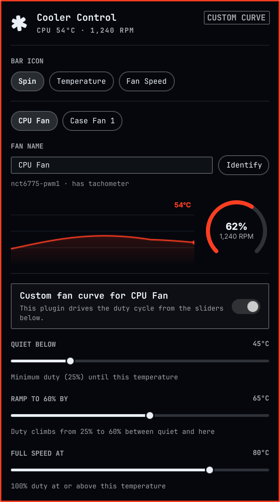

# Cooler Control

An [Omarchy](https://omarchy.org/) shell plugin for the CPU and case fans:
a bar widget with a real-time CPU temperature graph, a fan speed gauge, and
slider-driven fan curves for every pwm-capable fan the system exposes.



## Why

Linux exposes fan control through raw sysfs files under
`/sys/class/hwmon/hwmonN/` — no GUI, no live picture of what's actually
happening. This plugin turns that into a bar popup: a scrolling temperature
graph next to a fan-speed dial, and — per fan — a switch between "let the
board handle it" and a software curve set with three sliders (quiet below /
ramp to / full speed at).

## Install

```
git clone https://github.com/eddygarcas/omarchy-cooler-control.git \
  ~/.config/omarchy/plugins/eduard.cooler-control
omarchy-shell shell rescanPlugins
omarchy plugin enable eduard.cooler-control
```

## What it does

Click the bar icon to open the panel. The icon itself is one of three things,
picked with the **Bar icon** row at the top of the panel and remembered
across restarts:

- **Spin** (default) — a pinwheel that spins at the speed of your fastest
  connected fan.
- **Temperature** — a static thermometer glyph next to the CPU temperature
  (e.g. `55°`).
- **Fan Speed** — the same pinwheel glyph, but not spinning, next to the
  selected fan's duty cycle (e.g. `62%`) — this is a readout, not a live
  gauge, so the icon stays still even though the number updates.

Whichever one is showing, the tooltip and click-to-open behavior are the
same.

- **CPU temperature graph** — a live area+line chart of the last ~3 minutes,
  read from whichever hwmon chip actually reports the CPU die (`coretemp`,
  `k10temp`, `zenpower`, or `cpu_thermal`), not a motherboard sensor chip's
  ambient reading.
- **Fan gauge** — an open-arc dial (same look as Omarchy's own network/disk
  speed-test dials) showing the selected fan's current duty cycle and RPM.
- **Zone selector** — one pill button per pwm-capable fan the board exposes
  (CPU fan, case fans, pump, ...) that's actually plugged in, if there's more
  than one. A pwm header still shows up in sysfs with nothing connected to
  it, so this plugin drives each one and watches for an RPM response (or the
  chip's own fault flag, when it reports one) before offering it as a fan —
  an unplugged header never appears as a selectable zone. Unplugging a fan
  that was previously spinning removes it from the list within a few polls,
  same as if it had never been there.
- **Fan name + Identify** — sysfs has no concept of "front fan" or "CPU fan"
  beyond whatever label the board's own driver happens to report (many
  report none at all), so each zone starts out guessed: the first
  unlabeled pwm found is called "CPU Fan" (the common convention — a Super
  I/O chip's first header is normally wired to `CPU_FAN`), and every one
  after that "Case Fan N". **Identify** ramps that one fan to 100% for a
  few seconds so you can tell which physical fan it is by ear or by eye,
  and the name field next to it lets you rename it to whatever you actually
  see — "Front Intake", "Rear Exhaust", whatever fits your case. Renames
  persist across restarts; clearing the field goes back to the guess.
- **Custom fan curve** — a switch per fan. Off, the board's own fan curve (or
  BIOS/EC logic) stays in charge and this plugin only reads. On, three
  sliders drive the duty cycle from CPU temperature:
  - **Quiet below** — the fan holds at a fixed minimum duty (25%) at or under
    this temperature.
  - **Ramp to 60% by** — duty climbs linearly from 25% to 60% between "quiet"
    and here.
  - **Full speed at** — duty is 100% at or above this temperature, ramping
    linearly from 60% between "ramp" and here.
  - The three always keep quiet < ramp < full, same as the built-in Power
    Timings plugin's screensaver/lock/suspend sliders: dragging one past a
    neighbor pushes that neighbor forward instead of landing on an invalid
    order.
- **Detect Fan Controller** — shown when no pwm-capable hwmon device is
  found. Runs `sensors-detect --auto` via `pkexec` (the standard lm_sensors
  probe-and-load tool) and rescans afterward.

Every reported fan zone remembers its own mode and thresholds across
restarts, keyed by hwmon chip name + pwm index (e.g. `nct6775-pwm1`).

## Known limitations

- **Reads never need privilege; writes do.** Setting `pwmN_enable`/`pwmN` is
  root-only on stock sysfs permissions, so every write goes through
  `pkexec`. The unattended curve loop only queues a write when the target
  duty actually drifts from the last *confirmed* value by 3 points or more,
  and won't retry the same zone inside a 15-second window — so a system
  sitting at a steady temperature stays silent. It does **not** install a
  udev rule or polkit policy to make those writes passwordless, so depending
  on your polkit setup you may see an authentication prompt again a few
  minutes after the last one, even with nothing else changed.
- **The CPU Fan / Case Fan N guess is only a guess** (unless your board's
  driver already populates `fanN_label`, in which case that's used
  instead) — sysfs has no notion of which pwm header a fan is actually
  plugged into. Use **Identify** and the name field to confirm and fix it;
  see "Fan name + Identify" above.
- **Only one fan can be identified at a time.** Clicking Identify on
  another zone while one is already spinning up does nothing until the
  first one's pulse finishes (a few seconds).
- **"Connected" detection needs at least one real spin-up to confirm.** A
  zone is only marked connected once it's actually reported RPM > 0 (proof
  of life), so right after enabling this plugin every zone is assumed
  connected until the board's own duty happens to sit low enough, long
  enough, for a truly unplugged header to be caught (see `Model.js`'s
  `nextUnpluggedState`). A fan will disappear from the list once it's been
  driven hard and stayed at 0 RPM for a few consecutive polls in a row — if
  a real fan briefly reads 0 RPM at very low duty (some fans stop
  completely below their minimum start voltage), that alone won't hide it.
- **No fan chip found ≠ no fans.** Some boards' Super I/O / EC fan control
  never surfaces to Linux's hwmon subsystem at all; `sensors-detect` can't
  create hardware support that doesn't exist. If detection keeps coming up
  empty after a successful `sensors-detect` run, the board most likely
  doesn't expose pwm control to the OS.
- The fan curve only follows CPU temperature, even for case-fan zones —
  there's no per-zone temperature source selector in this version.

## Remove

```
omarchy plugin remove eduard.cooler-control
```

This deletes `~/.config/omarchy/plugins/eduard.cooler-control/`, removes the
widget from your bar layout, and stops the background poller — any fan
you'd switched to "custom" stays at whatever duty it last had until the
board's own logic (or a reboot) takes it back over. It does **not** revert
`pwmN_enable` back to the value it had before you enabled this plugin; toggle
each zone back to "auto" first if you want that restored automatically. It
also does not touch `~/.config/eduard.cooler-control/state.json` — delete
that by hand if you want thresholds/modes gone too.

## Permissions & dependencies

- Requires `lm_sensors` (for `sensors-detect`) if your board's fan controller
  isn't already exposed under `/sys/class/hwmon/`.
- Reads sysfs directly — no other packages or network access required.
- Writes to `pwmN` / `pwmN_enable` under `/sys/class/hwmon/` go through
  `pkexec`, which will prompt for authentication per your system's polkit
  policy.
- Persists per-fan mode and thresholds at
  `~/.config/eduard.cooler-control/state.json`.
- Like every Quickshell plugin, this code runs unsandboxed inside the shared
  `omarchy-shell` process — review `Panel.qml` / `Service.qml` before
  installing.

### Hardening

- Every executable this plugin runs (`pkexec`, `bash`, `sh`, `mkdir`,
  `sensors-detect`) is invoked by absolute path (`/usr/bin/...`), not by bare
  name — a privileged invocation should never let `PATH` decide what
  actually runs as root.
- Both scripts that run as root via `pkexec` (writing `pwmN`/`pwmN_enable`,
  and restoring `pwmN_enable` when a fan leaves custom mode) independently
  re-verify their path argument before touching anything: it must resolve
  under `/sys/class/hwmon/`, contain no `..` traversal segment, and not be a
  symlink. Unprivileged users can't actually plant a node under
  `/sys/class/hwmon` — it's kernel-managed — so this isn't fixing an
  exploitable-today hole, but a privileged script that trusts a path just
  because its own caller is "this plugin's JS" is exactly the class of thing
  a reviewer should flag, and future changes are one accidental copy-paste
  away from that assumption being wrong.
- Creating `~/.config/eduard.cooler-control/` (unprivileged — this only
  touches this user's own config) refuses to proceed if that path is
  already a symlink, and checks again right after `mkdir -p`, so a symlink
  planted there by anything else able to write under `~/.config` before
  this plugin first runs can't quietly redirect every later settings write
  to wherever it points.
- No shell metacharacter injection surface: every dynamic value (sysfs
  paths, the raw duty byte, the fan rename text) is passed as a positional
  argument (`$1`, `$2`, ...) to a fixed script body, never concatenated into
  the script text itself.

## Files

| File           | Purpose                                                          |
|----------------|-------------------------------------------------------------------|
| `manifest.json`| Plugin manifest (`service` + `bar-widget`)                        |
| `Panel.qml`    | Bar icon + popup UI (graph, gauge, sliders)                       |
| `Service.qml`  | hwmon detection, polling, fan-curve loop, privileged writes        |
| `Model.js`     | Curve math, formatting, threshold ordering                        |

## License

MIT — see [LICENSE](LICENSE).
