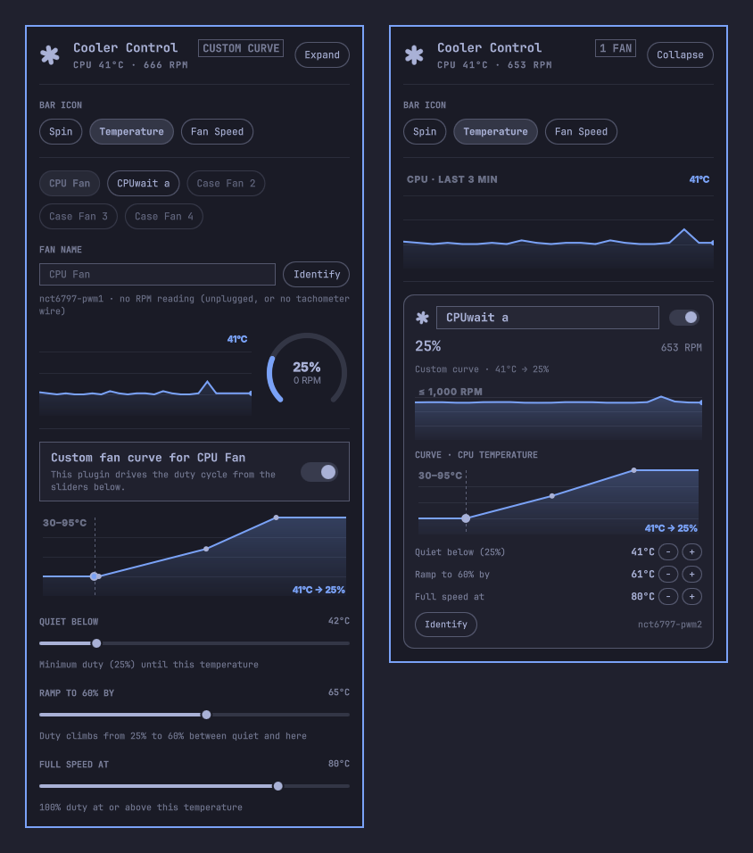

# Cooler Control

An [Omarchy](https://omarchy.org/) shell plugin for the CPU and case fans:
a bar widget with a real-time CPU temperature graph, a fan speed gauge, and
slider-driven fan curves for every pwm-capable fan the system exposes.



## Why

Linux exposes fan control through raw sysfs files under
`/sys/class/hwmon/hwmonN/` — no GUI, no live picture of what's actually
happening. This plugin turns that into a bar popup: a scrolling temperature
graph next to a fan-speed dial, and — per fan — a switch between "let the
board handle it" and a software curve set with three sliders (quiet below /
ramp to / full speed at).

## Install

```
git clone https://github.com/eddygarcas/omarchy-cooler-control.git \
  ~/.config/omarchy/plugins/eduard.cooler-control
omarchy-shell shell rescanPlugins
omarchy plugin enable eduard.cooler-control
```

## What it does

Click the bar icon to open the panel. The icon itself is one of three things,
picked with the **Bar icon** row at the top of the panel and remembered
across restarts:

- **Spin** (default) — a pinwheel that spins at the speed of your fastest
  connected fan.
- **Temperature** — a static thermometer glyph next to the CPU temperature
  (e.g. `55°`).
- **Fan Speed** — the same pinwheel glyph, but not spinning, next to the
  selected fan's duty cycle (e.g. `62%`) — this is a readout, not a live
  gauge, so the icon stays still even though the number updates.

Whichever one is showing, the tooltip and click-to-open behavior are the
same.

- **CPU temperature graph** — a live area+line chart of the last ~3 minutes,
  read from whichever hwmon chip actually reports the CPU die (`coretemp`,
  `k10temp`, `zenpower`, or `cpu_thermal`), not a motherboard sensor chip's
  ambient reading.
- **Fan gauge** — an open-arc dial (same look as Omarchy's own network/disk
  speed-test dials) showing the selected fan's current duty cycle and RPM.
- **Zone selector** — one pill button per pwm-capable header the board
  exposes (CPU fan, case fans, pump, ...), if there's more than one. A pwm
  header still shows up in sysfs with nothing connected to it, so a header
  that has not reported any RPM in the last ~3 minutes (or that the chip's
  own fault flag marks) is **dimmed**, not removed — "no RPM" also
  describes a real fan with no tachometer wire (a 2- or 3-pin fan on a
  4-pin header), and the one action that drives a fan hard enough to judge
  it is Identify, which used to make exactly such a fan vanish from the
  list mid-click. A dimmed zone stays selectable so it can still be
  identified, renamed, or driven; the caption under the name field says
  why it's dimmed. This is the same rule the expanded view uses to decide
  which fans get a card, so the two views always agree on which headers
  have a fan talking back.
- **Fan name + Identify** — sysfs has no concept of "front fan" or "CPU fan"
  beyond whatever label the board's own driver happens to report (many
  report none at all), so each zone starts out guessed: the first
  unlabeled pwm found is called "CPU Fan" (the common convention — a Super
  I/O chip's first header is normally wired to `CPU_FAN`), and every one
  after that "Case Fan N". **Identify** ramps that one fan to 100% for a
  few seconds so you can tell which physical fan it is by ear or by eye,
  and the name field next to it lets you rename it to whatever you actually
  see — "Front Intake", "Rear Exhaust", whatever fits your case. Renames
  persist across restarts; clearing the field goes back to the guess. Names
  are trimmed, stripped of control characters, and capped at 48 characters
  when read back (from the state file or the board's own label), since
  they're rendered into shell-owned controls.
- **Custom fan curve** — a switch per fan. Off, the board's own fan curve (or
  BIOS/EC logic) stays in charge and this plugin only reads. On, three
  sliders drive the duty cycle from CPU temperature:
  - **Quiet below** — the fan holds at a fixed minimum duty (25%) at or under
    this temperature.
  - **Ramp to 60% by** — duty climbs linearly from 25% to 60% between "quiet"
    and here.
  - **Full speed at** — duty is 100% at or above this temperature, ramping
    linearly from 60% between "ramp" and here.
  - The three always keep quiet < ramp < full, same as the built-in Power
    Timings plugin's screensaver/lock/suspend sliders: dragging one past a
    neighbor pushes that neighbor forward instead of landing on an invalid
    order.
  - The same curve is drawn above the sliders, and its three breakpoints
    can be dragged along the temperature axis as an alternative to the
    sliders (see "Expanded view" below for details).
- **Hardware truth, not just the switch** — every poll also reads
  `pwmN_enable`, the header's real control mode (`1` is manual, i.e.
  software-driven; `2` and up are the chip's own automatic modes). When it
  disagrees with the switch — the switch says Auto but the header is still
  manual, the switch says Custom but the board has taken the fan back, or
  the last write simply failed (a cancelled authentication prompt, say) —
  both views say so in red next to a **Hand back to board** / **Reapply
  curve** button that redoes the write. A header this plugin has driven in
  the current session is also handed back automatically, at the same pace
  as the curve loop, until the write lands.
- **Expanded view** — the **Expand** button in the panel header swaps the
  single-fan layout for one rounded card per fan that is actually reporting
  RPM, up to three across (the popup is capped to the screen and the cards
  share whatever width is left; extra rows scroll). A header that has sent
  no RPM in the last ~3 minutes — nothing plugged in, a fan without a
  tachometer wire, or one the board has stopped at idle — has nothing to
  chart, so it gets no card until it spins; it stays in the compact view's
  selector (dimmed) where it can still be identified or renamed. Each card
  has:
  - the fan's name (editable in place, same rules as the name field above)
    and its own custom-curve switch;
  - the live duty cycle and RPM, plus a one-line status (auto / custom
    curve with the duty the curve implies at the current CPU temperature /
    identifying / no RPM reading);
  - a speed graph of the last ~3 minutes — RPM when the header has a
    tachometer input, duty cycle otherwise — auto-scaled with the ceiling
    shown in its corner;
  - on a custom curve: the curve itself (duty against CPU temperature) with
    the three breakpoints marked and a dashed marker where the CPU currently
    sits on it, and the three thresholds as **−/+** steppers (click for
    1 °C, right-click for 5 °C) instead of sliders — the same quiet < ramp
    < full ordering rule applies;
  - the breakpoints on that chart are handles: **drag one left or right**
    to move that threshold (the chart previews live and commits when you
    let go). Only the temperature moves — a breakpoint's duty is fixed by
    the curve shape (25% / 60% / 100%). Dragging past a neighbour pushes it
    along, exactly like the sliders and steppers do;
  - an **Identify** button and the zone's hwmon key.

  Both views edit the same per-fan state, so a switch flipped, a threshold
  moved, or a name typed on a card is exactly what the compact view shows
  for that fan — and touching a card (any control on it, or its empty
  space) makes that fan the selected one, highlighted with a stronger
  fill, so **Collapse** lands on the fan just changed. The "Fan Speed" bar
  readout follows the same selection.

  The CPU temperature graph stays at the top, full width. **Collapse**
  brings back the compact view; the choice is remembered across restarts
  alongside the bar icon setting.
- **Detect Fan Controller** — shown when no pwm-capable hwmon device is
  found. Runs `sensors-detect --auto` via `pkexec` (the standard lm_sensors
  probe-and-load tool) and rescans afterward.

Every reported fan zone remembers its own mode and thresholds across
restarts, keyed by hwmon chip name + pwm index (e.g. `nct6775-pwm1`).

## Known limitations

- **Reads never need privilege; writes do.** Setting `pwmN_enable`/`pwmN` is
  root-only on stock sysfs permissions. Every write is first tried as your
  own user (a udev rule granting group write on those files makes that
  succeed); when that's refused, the plugin starts **one** privileged helper
  for the rest of the shell session via `pkexec`, which prompts for
  authentication once, and hands every later write to that same helper —
  so you're asked once per session, not once per write. The helper exits
  when the shell does (or when the prompt is cancelled). The unattended
  curve loop still only queues a write when the target duty actually drifts
  from the last *confirmed* value by 3 points or more, and won't retry the
  same zone inside a 15-second window. It does **not** install a udev rule
  or polkit policy. A write that fails — most often because the prompt was
  cancelled — is not silent: the zone shows the failure in red with a
  button to redo it, and the panel always reflects the mode the header is
  really in rather than the one that was requested.
- **"Auto" restores the chip's own automatic mode.** Handing a header back
  normally writes the `pwmN_enable` value captured when the plugin first
  saw it. If that value was itself manual (`1`) — a previous session's
  hand-back never landed, or another tool left it so — restoring it would
  restore nothing, so the plugin instead uses the automatic mode the other
  headers on the same chip are running, and failing that `2`, the sysfs
  ABI's generic "automatic" value. On an nct6775-family chip that is
  Thermal Cruise rather than the SmartFan mode your BIOS may have chosen;
  set it back in the BIOS if you notice a difference.
- **The CPU Fan / Case Fan N guess is only a guess** (unless your board's
  driver already populates `fanN_label`, in which case that's used
  instead) — sysfs has no notion of which pwm header a fan is actually
  plugged into. Use **Identify** and the name field to confirm and fix it;
  see "Fan name + Identify" above.
- **Only one fan can be identified at a time.** Clicking Identify on
  another zone while one is already spinning up does nothing until the
  first one's pulse finishes (a few seconds).
- **"No RPM" is a hint, not proof of an empty header.** A zone is only
  marked as having a fan once it's actually reported RPM > 0 (proof of
  life), and is dimmed once it's been driven at a real duty and stayed at
  0 RPM for a few consecutive polls (see `Model.js`'s `nextUnpluggedState`).
  A fan without a tachometer wire will always be dimmed; it still works.
  A real fan briefly reading 0 RPM at very low duty (some stop completely
  below their minimum start voltage) won't be dimmed by that alone.
- **No fan chip found ≠ no fans.** Some boards' Super I/O / EC fan control
  never surfaces to Linux's hwmon subsystem at all; `sensors-detect` can't
  create hardware support that doesn't exist. If detection keeps coming up
  empty after a successful `sensors-detect` run, the board most likely
  doesn't expose pwm control to the OS.
- The fan curve only follows CPU temperature, even for case-fan zones —
  there's no per-zone temperature source selector in this version.

## Remove

```
omarchy plugin remove eduard.cooler-control
```

This deletes `~/.config/omarchy/plugins/eduard.cooler-control/`, removes the
widget from your bar layout, and stops the background poller — any fan
you'd switched to "custom" stays at whatever duty it last had until the
board's own logic (or a reboot) takes it back over. It does **not** revert
`pwmN_enable` back to the value it had before you enabled this plugin; toggle
each zone back to "auto" first if you want that restored automatically. It
also does not touch `~/.config/eduard.cooler-control/state.json` — delete
that by hand if you want thresholds/modes gone too.

## Permissions & dependencies

- Requires `lm_sensors` (for `sensors-detect`) if your board's fan controller
  isn't already exposed under `/sys/class/hwmon/`.
- Reads sysfs directly — no other packages or network access required.
- Writes to `pwmN` / `pwmN_enable` under `/sys/class/hwmon/` that the
  plain user can't perform go through a single per-session helper started
  with `pkexec`, which prompts for authentication once per shell session per
  your system's polkit policy.
- Persists per-fan mode and thresholds at
  `~/.config/eduard.cooler-control/state.json`; the bar icon style and the
  expanded/compact choice live in the widget's entry in
  `~/.config/omarchy/shell.json`.
- Like every Quickshell plugin, this code runs unsandboxed inside the shared
  `omarchy-shell` process — review `Panel.qml` / `Service.qml` before
  installing.

### Hardening

- Every executable this plugin runs (`pkexec`, `bash`, `sh`, `mkdir`,
  `sensors-detect`) is invoked by absolute path (`/usr/bin/...`), not by bare
  name — a privileged invocation should never let `PATH` decide what
  actually runs as root.
- The per-session helper that runs as root via `pkexec` speaks a fixed
  two-field protocol (`path<TAB>value`, one write per line) and nothing
  else: the value must be a plain integer 0–255, and the path is
  independently re-verified before every write — it must resolve under
  `/sys/class/hwmon/`, contain no `..` traversal segment, and not be a
  symlink. Any malformed line makes the helper exit rather than skip it.
  The unprivileged one-shot write scripts apply the same path guard. Unprivileged users can't actually plant a node under
  `/sys/class/hwmon` — it's kernel-managed — so this isn't fixing an
  exploitable-today hole, but a privileged script that trusts a path just
  because its own caller is "this plugin's JS" is exactly the class of thing
  a reviewer should flag, and future changes are one accidental copy-paste
  away from that assumption being wrong.
- Creating `~/.config/eduard.cooler-control/` (unprivileged — this only
  touches this user's own config) refuses to proceed if that path is
  already a symlink, and checks again right after `mkdir -p`, so a symlink
  planted there by anything else able to write under `~/.config` before
  this plugin first runs can't quietly redirect every later settings write
  to wherever it points.
- No shell metacharacter injection surface: every dynamic value (sysfs
  paths, the raw duty byte, the fan rename text) is passed as a positional
  argument (`$1`, `$2`, ...) to a fixed script body, never concatenated into
  the script text itself.

## Files

| File           | Purpose                                                          |
|----------------|-------------------------------------------------------------------|
| `manifest.json`| Plugin manifest (`service` + `bar-widget`)                        |
| `Panel.qml`    | Bar icon + popup UI (graph, gauge, sliders, expanded fan cards)   |
| `Service.qml`  | hwmon detection, polling, fan-curve loop, privileged writes        |
| `Model.js`     | Curve math, formatting, threshold ordering                        |

## License

MIT — see [LICENSE](LICENSE).
